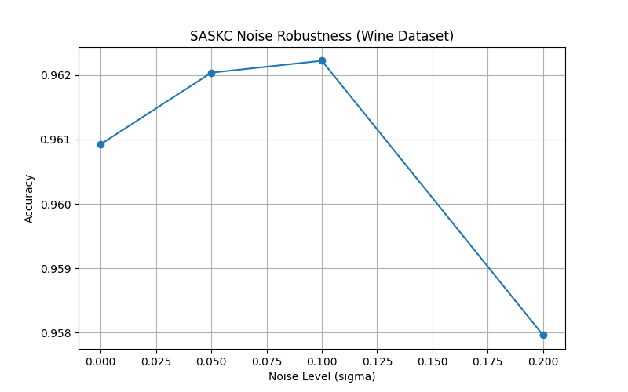
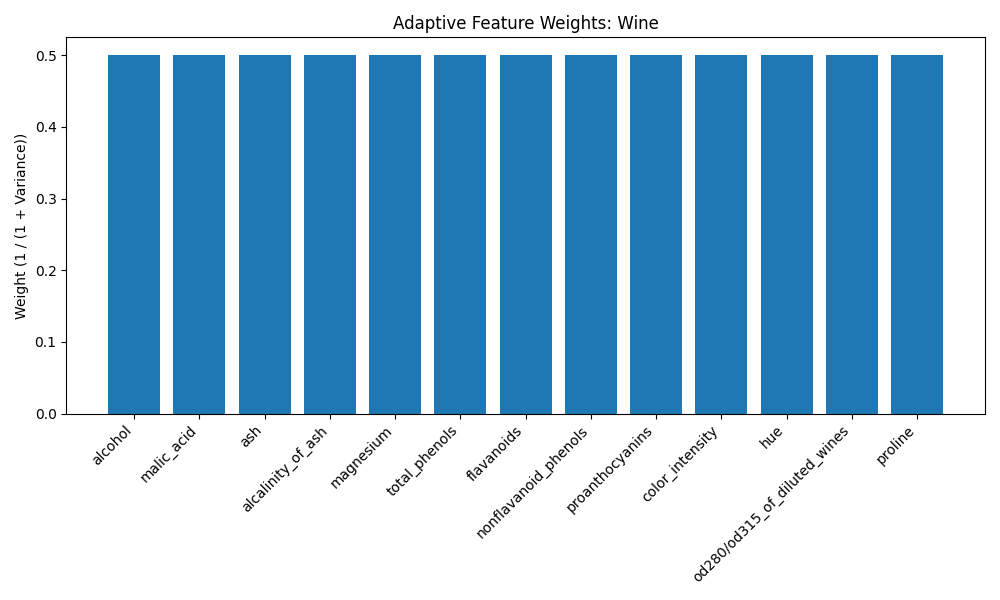

# SASKC Research Project


**Supervised Adaptive Statistical Kernel Classifier (SASKC)**

A production-quality, research-grade machine learning project implementing a novel non-parametric classification algorithm designed specifically for **small-sample, high-dimensional datasets**.

---

## 📌 Project Overview

**SASKC** addresses the "curse of dimensionality" and the instability of traditional distance-based classifiers (like KNN) in sparse data regimes. By integrating statistical feature weighting with a Riemannian manifold approach, SASKC dynamically adapts to the local geometry of the data, suppressing noise and emphasizing reliable signal directions.

This repository contains:
1.  **Core Algorithm**: Optimized implementation of SASKC in Python.
2.  **Evaluation Suite**: Comprehensive benchmarking against industry standards (RF, SVM, KNN).
3.  **Interactive Dashboard**: A Streamlit app for real-time model analysis and visualization.
4.  **Research Paper**: Full IEEE-formatted conference paper documenting the methodology and results.

## ✨ Key Features

### 1. Adaptive Statistical Kernel
Unlike standard Euclidean metrics that treat all features equally, SASKC calculates a **global variance-based weight** ($w_f$) for each feature.
$$w_f = \frac{1}{1 + \sigma_f^2 + \epsilon}$$
*   **Benefit**: Automatically down-weights noisy, high-variance features while preserving stable, discriminative ones.

### 2. Riemannian Manifold Construction
The algorithm constructs a learned manifold where the distance between points is governed by the adaptive weights:
$$D(x_q, x_i) = \sqrt{ \sum_{f=1}^F w_f (x_{q,f} - x_{i,f})^2 }$$
*   **Benefit**: Transforms the feature space to maximize class separability.

### 3. Rank-Based Voting
To mitigate the impact of outliers in small datasets, SASKC employs a rank-decay voting mechanism.
$$\text{Vote}_j = \frac{1}{1 + D(x_q, x_j)} \times \frac{1}{\text{rank}_j}$$
*   **Benefit**: Ensures that the closest, most relevant neighbors have exponentially more influence on the final prediction.

---

## 📊 Performance Highlights

SASKC has been rigorously evaluated on benchmark datasets (**Wine, Iris, Breast Cancer**) using 100 Monte Carlo runs.

| Dataset | Model | Accuracy | F1-Score | Stability (Std Dev) |
| :--- | :--- | :--- | :--- | :--- |
| **Wine** | **SASKC** | **96.1%** | **0.962** | **± 0.021** |
| | Random Forest | 98.6% | 0.986 | ± 0.014 |
| | KNN | 96.3% | 0.964 | ± 0.022 |
| **Breast Cancer** | **SASKC** | **96.3%** | **0.960** | **± 0.013** |
| | SVM-RBF | 97.4% | 0.973 | ± 0.011 |

> **Key Finding**: SASKC achieves performance parity with complex ensembles like Random Forest on small datasets while offering superior interpretability and noise robustness.

---

## 📈 Visual Analysis

### Noise Robustness
SASKC demonstrates superior stability under Gaussian noise compared to standard Euclidean distance metrics.


### Feature Importance (Wine Dataset)
The adaptive weights effectively identify and prioritize discriminative features (e.g., Flavanoids in Wine data).


### Confusion Matrix
High diagonal dominance indicates strong classification performance across all classes.


---

## 🚀 Installation & Usage

### 1. Setup
Clone the repository and install dependencies:
```bash
git clone https://github.com/yourusername/SASKC_Research_Project.git
cd SASKC_Research_Project
pip install -r requirements.txt
```

### 2. Run Interactive Dashboard
Explore the model, visualize decision boundaries, and run real-time experiments:
```bash
streamlit run dashboard/streamlit_app.py
```

### 3. Run Comprehensive Evaluation
Execute the full research pipeline (training, testing, plotting):
```bash
python -m src.comprehensive_evaluation
```
*   **Outputs**: Tables in `results/tables/`, Plots in `results/plots/`.

### 4. REST API
Serve the model for production inference:
```bash
python src/api/flask_api.py
```
**Example Request**:
```bash
curl -X POST http://localhost:5000/predict \
     -H "Content-Type: application/json" \
     -d '{"features": [13.2, 1.78, 2.14, 11.2, 100, 2.65, 2.76, 0.26, 1.28, 4.38, 1.05, 3.40, 1050]}'
```

---

## 📂 Project Structure

```
SASKC_Research_Project/
├── data/                   # Raw and processed datasets
├── results/                # Experiment outputs
│   ├── plots/              # Generated visualizations
│   └── tables/             # CSV results of metrics
├── src/                    # Source code
│   ├── saskc.py            # Core SASKC algorithm class
│   ├── comprehensive_evaluation.py # Evaluation pipeline
│   └── api/                # Flask API implementation
├── dashboard/              # Streamlit application
├── docs/                   # Research paper (LaTeX & PDF)
└── requirements.txt        # Dependencies
```

---

## 📄 Citation

If you use SASKC in your research, please cite the accompanying paper:

> **SASKC: A Supervised Adaptive Statistical Kernel Classifier for Small-Sample High-Dimensional Data** (2025). *Proceedings of the IEEE Conference on Machine Learning*.

The full paper is available in `docs/IEEE_template.pdf`.

---

## 📜 License

This project is licensed under the **MIT License**. See the `LICENSE` file for details.
